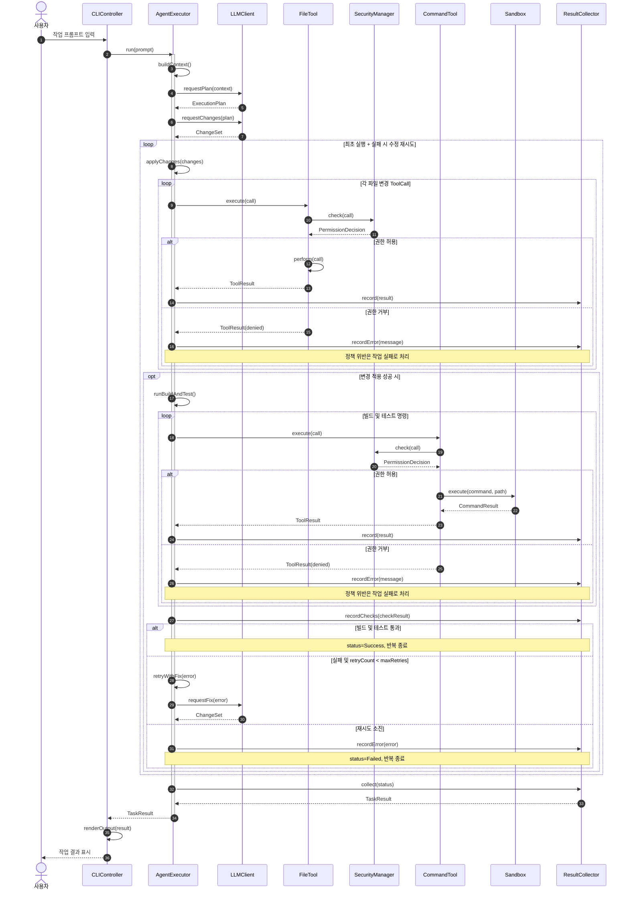

# Sequence Diagram

```mermaid
sequenceDiagram
    autonumber
    actor User as 사용자
    participant CLI as CLIController
    participant Agent as AgentExecutor
    participant LLM as LLMClient
    participant File as FileTool
    participant Security as SecurityManager
    participant Command as CommandTool
    participant Sandbox as Sandbox
    participant Collector as ResultCollector

    User->>CLI: 작업 프롬프트 입력
    CLI->>Agent: run(prompt)
    activate Agent
    Agent->>Agent: buildContext()
    Agent->>LLM: requestPlan(context)
    LLM-->>Agent: ExecutionPlan
    Agent->>LLM: requestChanges(plan)
    LLM-->>Agent: ChangeSet

    loop 최초 실행 + 실패 시 수정 재시도
        Agent->>Agent: applyChanges(changes)
        loop 각 파일 변경 ToolCall
            Agent->>File: execute(call)
            File->>Security: check(call)
            Security-->>File: PermissionDecision
            alt 권한 허용
                File->>File: perform(call)
                File-->>Agent: ToolResult
                Agent->>Collector: record(result)
            else 권한 거부
                File-->>Agent: ToolResult(denied)
                Agent->>Collector: recordError(message)
                Note over Agent,Collector: 정책 위반은 작업 실패로 처리
            end
        end

        opt 변경 적용 성공 시
            Agent->>Agent: runBuildAndTest()
            loop 빌드 및 테스트 명령
                Agent->>Command: execute(call)
                Command->>Security: check(call)
                Security-->>Command: PermissionDecision
                alt 권한 허용
                    Command->>Sandbox: execute(command, path)
                    Sandbox-->>Command: CommandResult
                    Command-->>Agent: ToolResult
                    Agent->>Collector: record(result)
                else 권한 거부
                    Command-->>Agent: ToolResult(denied)
                    Agent->>Collector: recordError(message)
                    Note over Agent,Collector: 정책 위반은 작업 실패로 처리
                end
            end
            Agent->>Collector: recordChecks(checkResult)
            alt 빌드 및 테스트 통과
                Note over Agent,Collector: status=Success, 반복 종료
            else 실패 및 retryCount < maxRetries
                Agent->>Agent: retryWithFix(error)
                Agent->>LLM: requestFix(error)
                LLM-->>Agent: ChangeSet
            else 재시도 소진
                Agent->>Collector: recordError(error)
                Note over Agent,Collector: status=Failed, 반복 종료
            end
        end
    end

    Agent->>Collector: collect(status)
    Collector-->>Agent: TaskResult
    Agent-->>CLI: TaskResult
    deactivate Agent
    CLI->>CLI: renderOutput(result)
    CLI-->>User: 작업 결과 표시
```

# State Diagram

```mermaid
sequenceDiagram
    autonumber
    actor User as 사용자
    participant CLI as CLIController
    participant Agent as AgentExecutor
    participant LLM as LLMClient
    participant File as FileTool
    participant Security as SecurityManager
    participant Command as CommandTool
    participant Sandbox as Sandbox
    participant Collector as ResultCollector

    User->>CLI: 작업 프롬프트 입력
    CLI->>Agent: run(prompt)
    activate Agent
    Agent->>Agent: buildContext()
    Agent->>LLM: requestPlan(context)
    LLM-->>Agent: ExecutionPlan
    Agent->>LLM: requestChanges(plan)
    LLM-->>Agent: ChangeSet

    loop 최초 실행 + 실패 시 수정 재시도
        Agent->>Agent: applyChanges(changes)
        loop 각 파일 변경 ToolCall
            Agent->>File: execute(call)
            File->>Security: check(call)
            Security-->>File: PermissionDecision
            alt 권한 허용
                File->>File: perform(call)
                File-->>Agent: ToolResult
                Agent->>Collector: record(result)
            else 권한 거부
                File-->>Agent: ToolResult(denied)
                Agent->>Collector: recordError(message)
                Note over Agent,Collector: 정책 위반은 작업 실패로 처리
            end
        end

        opt 변경 적용 성공 시
            Agent->>Agent: runBuildAndTest()
            loop 빌드 및 테스트 명령
                Agent->>Command: execute(call)
                Command->>Security: check(call)
                Security-->>Command: PermissionDecision
                alt 권한 허용
                    Command->>Sandbox: execute(command, path)
                    Sandbox-->>Command: CommandResult
                    Command-->>Agent: ToolResult
                    Agent->>Collector: record(result)
                else 권한 거부
                    Command-->>Agent: ToolResult(denied)
                    Agent->>Collector: recordError(message)
                    Note over Agent,Collector: 정책 위반은 작업 실패로 처리
                end
            end
            Agent->>Collector: recordChecks(checkResult)
            alt 빌드 및 테스트 통과
                Note over Agent,Collector: status=Success, 반복 종료
            else 실패 및 retryCount < maxRetries
                Agent->>Agent: retryWithFix(error)
                Agent->>LLM: requestFix(error)
                LLM-->>Agent: ChangeSet
            else 재시도 소진
                Agent->>Collector: recordError(error)
                Note over Agent,Collector: status=Failed, 반복 종료
            end
        end
    end

    Agent->>Collector: collect(status)
    Collector-->>Agent: TaskResult
    Agent-->>CLI: TaskResult
    deactivate Agent
    CLI->>CLI: renderOutput(result)
    CLI-->>User: 작업 결과 표시
```

